# 🔐 Zero Trust Identity & IAM Workflow Lab

[](LICENSE)
[](https://docs.docker.com/compose/)
[](https://www.keycloak.org/)
[](https://openbao.org/)

## 📺 Video Demonstration

**[Watch the Full Demo Walkthrough on YouTube](https://youtu.be/CBMsW2FbgQk)**  
*Shows the full JML lifecycle, OpenBao secrets injection, and Elastic SIEM event routing in action.*

---

## Overview

A production-like **Zero Trust Identity & Access Management (IAM)** platform demonstrating enterprise IAM workflows using **Keycloak SSO** (OpenID Connect), **OpenBao** secrets management, **Nginx** reverse proxy with TLS, and **ELK Stack** SIEM integration. Features a complete **Joiner/Mover/Leaver (JML) lifecycle engine**, **access review certification workflow**, **MFA enforcement**, **SIEM evidence panels**, and **impact metrics dashboard**.

Every design decision follows Zero Trust principles: **never trust, always verify**.

This project is a fully containerized, single-command deployment that mirrors the identity security stack used in enterprise environments — built as a portfolio piece demonstrating hands-on IAM engineering skills.

---

## Architecture


> 📘 See [ARCHITECTURE.md](ARCHITECTURE.md) for a detailed technical breakdown of each component and data flow.

---

## IAM Use-Case Narrative

This lab models how enterprise Identity & Access Management works in practice. Here's the real-world parallel:

| Lab Feature | Enterprise Equivalent | Real-World Service |
|---|---|---|
| **Joiner workflow** | New employee onboarding | Azure AD / Okta user provisioning |
| **Mover workflow** | Internal transfer / role recomputation | SailPoint IdentityNow lifecycle events |
| **Leaver workflow** | Offboarding / access revocation | ServiceNow ITSM + SCIM deprovisioning |
| **Access Reviews** | Periodic access certification campaigns | SailPoint Access Certifications, Azure AD Access Reviews |
| **MFA enforcement** | Step-up authentication for privileged actions | Okta Adaptive MFA, Azure Conditional Access |
| **SIEM integration** | Identity threat detection & audit trail | Splunk, Microsoft Sentinel, Elastic SIEM |
| **KPI Metrics** | IAM program health & operational metrics | Identity Governance dashboards |
| **RBAC with Keycloak** | Centralized role management | Azure AD Roles, Okta Groups, CyberArk |
| **Secrets from OpenBao** | Runtime secrets management | HashiCorp Vault, AWS Secrets Manager |

### JML Lifecycle Flow

```
   Joiner                    Mover                      Leaver
  ┌─────────┐            ┌───────────┐             ┌──────────┐
  │ Create  │            │ Transfer  │             │ Disable  │
  │ user    │            │ department│             │ user     │
  │ profile │            │           │             │ account  │
  └────┬────┘            └─────┬─────┘             └────┬─────┘
       │                       │                        │
       ▼                       ▼                        ▼
  ┌─────────┐            ┌───────────┐             ┌──────────┐
  │ Auto-   │            │ Recompute │             │ Revoke   │
  │ assign  │            │ role from │             │ all      │
  │ baseline│            │ dept map  │             │ roles    │
  │ role    │            │           │             │          │
  └────┬────┘            └─────┬─────┘             └────┬─────┘
       │                       │                        │
       ▼                       ▼                        ▼
  ┌─────────┐            ┌───────────┐             ┌──────────┐
  │ Log JML │            │ Log JML   │             │ Log JML  │
  │ event + │            │ event +   │             │ event +  │
  │ SIEM    │            │ SIEM      │             │ SIEM     │
  └─────────┘            └───────────┘             └──────────┘
```

---

## RBAC + MFA Policy Matrix

| Route | Required Role | MFA Required | Fallback |
|---|---|---|---|
| `/app/` | None (public) | No | — |
| `/app/dashboard` | Authenticated | No | Redirect to login |
| `/app/secrets` | `zero-trust-admin` OR `zero-trust-user` | No | RBAC denied |
| `/app/admin` | `zero-trust-admin` | Yes | MFA required page |
| `/app/admin/iam/joiner` | `zero-trust-admin` | Yes | MFA required page |
| `/app/admin/iam/mover` | `zero-trust-admin` | Yes | MFA required page |
| `/app/admin/iam/leaver` | `zero-trust-admin` | Yes | MFA required page |
| `/app/admin/reviews` | `zero-trust-admin` | Yes | MFA required page |
| `/app/admin/reviews/decide` | `zero-trust-admin` | Yes | MFA required page |
| `/app/admin/reviews/export` | `zero-trust-admin` | Yes | MFA required page |

**MFA Enforcement Modes:**

| Mode | Env Variable | Behavior |
|---|---|---|
| **Demo (default)** | `FLASK_ADMIN_MFA_STRICT=false` | Admin actions allowed with visible warning banner; bypass logged to SIEM |
| **Strict** | `FLASK_ADMIN_MFA_STRICT=true` | Admin actions blocked without MFA; redirected to MFA setup page |

---

## Zero Trust Principles Implemented

| Principle | Implementation |
|-----------|---------------|
| 🔍 **Never Trust, Always Verify** | Every request authenticated via Keycloak OIDC tokens |
| 🔒 **Least Privilege** | RBAC roles with scoped OpenBao policies (`flask-app-policy`) |
| ⏱️ **Short-Lived Tokens** | Access tokens: 5 minutes · Sessions: 1 hour max |
| 🔑 **Secrets Never Hardcoded** | All secrets fetched at runtime from OpenBao KV engine |
| 📊 **All Access Logged** | Keycloak events + Nginx logs + SIEM events shipped to ELK |
| 🛡️ **TLS Everywhere** | Nginx enforces HTTPS with HSTS, CSP, and security headers |
| 🔐 **MFA Enforcement** | TOTP/OTP enforced for admin actions with configurable strictness |
| 🌐 **Network Isolation** | Docker networks separate identity and monitoring traffic |
| 👤 **Identity Lifecycle** | JML workflow manages user onboarding, transfers, and offboarding |
| ✅ **Access Certification** | Periodic access reviews with approve/revoke + audit trail |

---

## Tech Stack

| Component | Technology | Version | Purpose |
|-----------|-----------|---------|---------| 
| Identity Provider | Keycloak | 24.0.4 | SSO, OIDC, RBAC, MFA |
| Secrets Engine | OpenBao | 2.0.0 | KV secrets management |
| Reverse Proxy | Nginx | 1.25-alpine | TLS termination, security headers |
| Demo Application | Flask (Python) | 3.0.3 | OIDC-protected web app with IAM workflows |
| IAM Data Store | SQLite | 3.x | JML records, access reviews, SIEM events |
| Database | PostgreSQL | 16-alpine | Keycloak persistent store |
| Search Engine | Elasticsearch | 8.13.4 | Log storage & analysis |
| Dashboards | Kibana | 8.13.4 | SIEM visualization |
| Log Shipper | Filebeat | 8.13.4 | Log collection & forwarding |
| Orchestration | Docker Compose | v2 | Container orchestration |

---

## Quick Start

### Prerequisites

- [Docker](https://docs.docker.com/get-docker/) (20.10+)
- [Docker Compose](https://docs.docker.com/compose/install/) v2
- OpenSSL (for certificate generation)
- 8GB+ RAM recommended (Elasticsearch needs ~512MB)

### Deploy

```bash
# Clone the repository
git clone https://github.com/lenoshz/zero-trust-identity-lab.git
cd zero-trust-identity-lab

# Make scripts executable
chmod +x scripts/bootstrap.sh

# Deploy everything with a single command
./scripts/bootstrap.sh
```

> ⚠️ **Self-signed certificates**: Accept the browser security warning when accessing `https://localhost`.

### Manual Setup (if not using bootstrap.sh)

```bash
# 1. Generate TLS certificates
chmod +x nginx/ssl/generate-certs.sh
./nginx/ssl/generate-certs.sh

# 2. Start all services
docker compose up -d

# 3. Wait for services to be healthy (~90 seconds)
docker compose ps

# 4. Seed OpenBao secrets
chmod +x openbao/init/setup.sh
./openbao/init/setup.sh

# 5. Check health
chmod +x scripts/healthcheck.sh
./scripts/healthcheck.sh
```

---

## Service URLs

| Service | URL | Credentials |
|---------|-----|-------------|
| 🌐 Demo Application | `https://localhost/app` | See demo users below |
| 🔐 Keycloak Login | `https://localhost/auth` | Demo users below |
| ⚙️ Keycloak Admin Console | `https://localhost/auth/admin` | `admin` / `Admin@ZeroTrust1` |
| 📊 Kibana SIEM | `https://localhost/kibana` | `elastic` / `Elastic@ZeroTrust1` |
| 🔑 OpenBao UI | `http://localhost:8200` | Token: `root-dev-token-zerotrust` |

### Demo Users

| Username | Password | Role | Access Level |
|----------|----------|------|-------------|
| `ztadmin` | `Admin@123` | `zero-trust-admin` | Full administrative access + IAM workflows |
| `ztuser` | `User@123` | `zero-trust-user` | Standard read/write access |
| `ztviewer` | `View@123` | `zero-trust-readonly` | Read-only access |

---

## Demo Walkthrough

### 1. Authenticate via Keycloak OIDC

Navigate to `https://localhost/app` and click **"Authenticate with Keycloak"**. You'll be redirected to the Keycloak login page.

### 2. Log in as Admin

Sign in as `ztadmin` with password `Admin@123`. Keycloak issues a short-lived JWT access token (5-minute TTL) and redirects you back to the Flask app.

### 3. View the Identity Dashboard

The dashboard displays:
- **KPI Metrics**: Onboarding time, offboarding completion, privileged accounts, MFA coverage, review completion with trend arrows
- Your authenticated username, email, and role assignments
- Token expiry countdown with live status chip
- OpenBao connection status
- **Audit Log**: Session-scoped events
- **Live Health**: Per-service response codes and latency
- **Security Events (SIEM)**: Persistent security event timeline with filter chips and Kibana deep-link

### 4. Manage User Lifecycle (JML)

- **Joiner** (`/app/admin/iam/joiner`): Create a new user → auto-assigns baseline role by department
- **Mover** (`/app/admin/iam/mover`): Transfer user to new department → role automatically recomputed
- **Leaver** (`/app/admin/iam/leaver`): Disable user → all roles revoked, sessions invalidated

### 5. Conduct Access Reviews

Navigate to `/app/admin/reviews`:
- Review each user's role assignment with risk level tagging (Low / Medium / High / Critical)
- Approve role assignments with one click
- Revoke elevated access with mandatory justification comment
- Export all review decisions as CSV for compliance evidence

### 6. View Secrets from OpenBao

Navigate to `/app/secrets` to see application secrets fetched in real-time from OpenBao's KV v2 engine. All values are masked — never exposed in source code.

### 7. Generate SIEM Events

- **Failed login**: Try logging in with the wrong password — Keycloak logs `LOGIN_ERROR`
- **Admin action**: Access the admin panel — logged as `admin_action`
- **JML event**: Create/move/disable a user — logged with full audit detail
- **Access review**: Approve or revoke — logged as `review_decision`
- **MFA bypass**: Access admin in demo mode — logged as `mfa_bypass`

All events are visible in the Dashboard's Security Events panel and flow to ELK via Filebeat.

### 8. View Kibana Dashboards

Navigate to `https://localhost/kibana` and explore the `zerotrust-logs-*` index pattern to see real-time identity events. Use the "Open in Kibana" button from the dashboard for pre-filtered queries.

---

## JML + Access Review Test Scenarios

### Joiner Test

```
1. Log in as ztadmin
2. Navigate to /app/admin/iam/joiner
3. Create user: username=testuser1, email=test@co.com, name=Test User, dept=Engineering
4. Verify: success message shown, role auto-assigned = zero-trust-user
5. Verify: user appears in Recent Joiners table
6. Verify: security event logged in SIEM panel
```

### Mover Test

```
1. Navigate to /app/admin/iam/mover
2. Select testuser1 → see current: Engineering / zero-trust-user
3. Change to department: Security
4. Verify: transfer preview shows Engineering→Security, role→zero-trust-admin
5. Submit → verify success, role recomputed
6. Verify: movement history updated
```

### Leaver Test

```
1. Navigate to /app/admin/iam/leaver
2. Select testuser1
3. Review revocation checklist → confirm disable
4. Verify: user disabled, roles revoked
5. Verify: user appears in Disabled Users table
6. Verify: user no longer in Mover/Joiner active user lists
```

### Access Review Test

```
1. Navigate to /app/admin/reviews
2. Review ztadmin → Risk Level = CRITICAL → Approve
3. Review ztuser → Risk Level = MEDIUM → Revoke with reason: "Access no longer needed"
4. Verify: review history updated with decision + reviewer + timestamp
5. Click Export CSV → verify downloaded file contains decisions
6. Verify: review completion percentage updates
```

### MFA Enforcement Test

```
# Demo mode (default):
1. Log in as ztadmin → access /app/admin
2. Verify: yellow "MFA Not Verified" warning banner shown
3. Verify: admin actions still functional
4. Verify: mfa_bypass event logged in security events

# Strict mode:
1. Set FLASK_ADMIN_MFA_STRICT=true in .env
2. docker compose up -d flask-app
3. Access /app/admin → verify: redirected to MFA Required page
4. Verify: mfa_denied event in security events
```

---

## KPI Metrics Explained

| Metric | What It Measures | Why It Matters |
|---|---|---|
| **Avg. Onboarding Time** | Simulated time from joiner creation to role assignment | Slow onboarding = security gap (no access) or risk (rushed permissions) |
| **Offboarding Completion %** | % of disabled users with all roles fully revoked | Incomplete offboarding = orphaned accounts = security risk |
| **Privileged Accounts** | Count of users with `zero-trust-admin` role | Excessive privilege = expanded attack surface |
| **MFA Coverage %** | % of active users with MFA configured (simulated) | Low MFA = credential theft risk |
| **Review Completion %** | % of users with a completed access review | Low completion = stale entitlements = compliance gap |

### Trend Arrows

Each KPI shows a trend arrow (↑/↓/→) comparing the current value to the prior snapshot:
- **Green ↑/↓**: Improvement (higher completion %, lower onboarding time, fewer privileged accounts)
- **Red ↑/↓**: Degradation
- **Gray →**: No significant change

---

## System Gallery

### 1. Zero Trust Architecture Landing Page
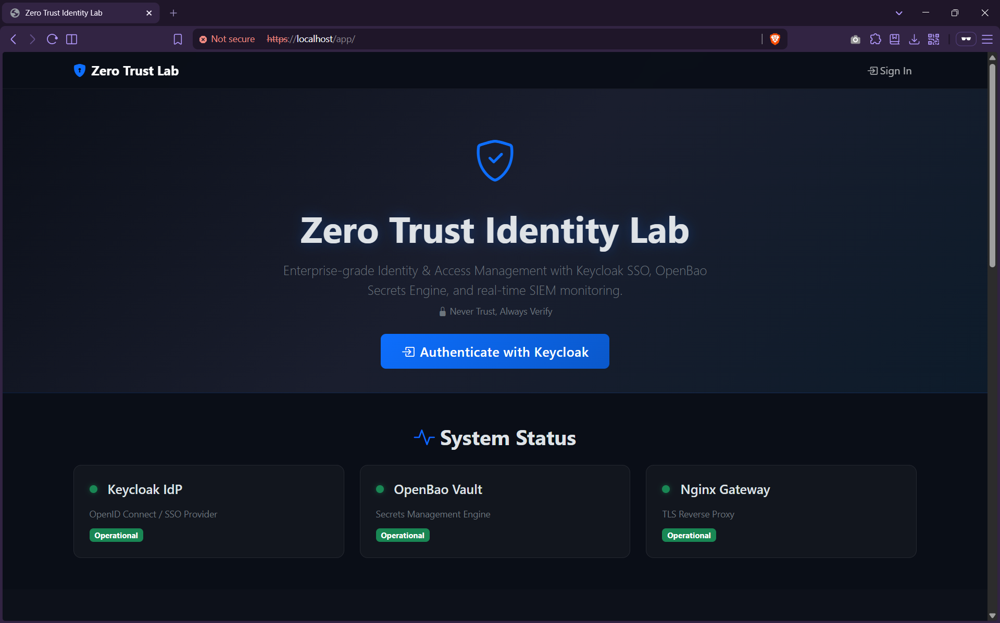

### 2. Keycloak OIDC Authentication
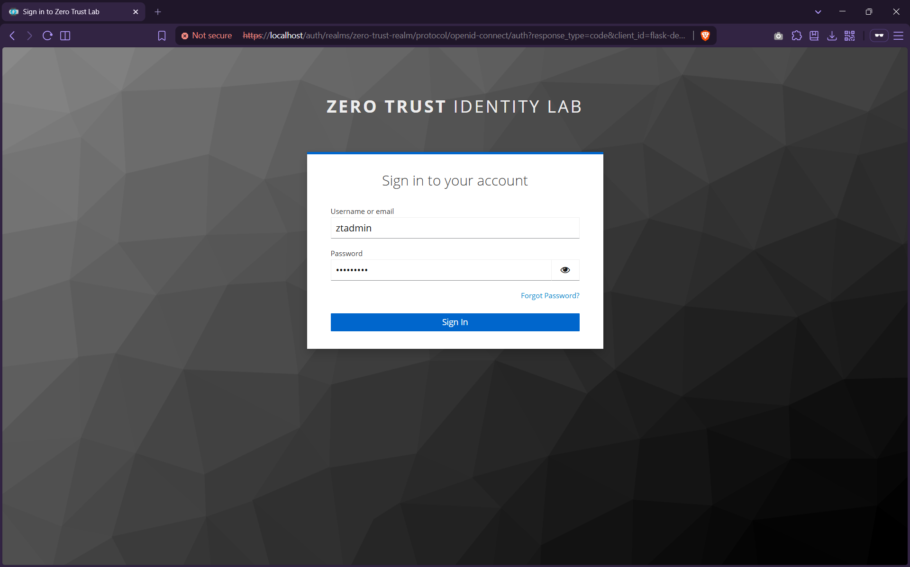

### 3. Identity Dashboard & KPI Metrics
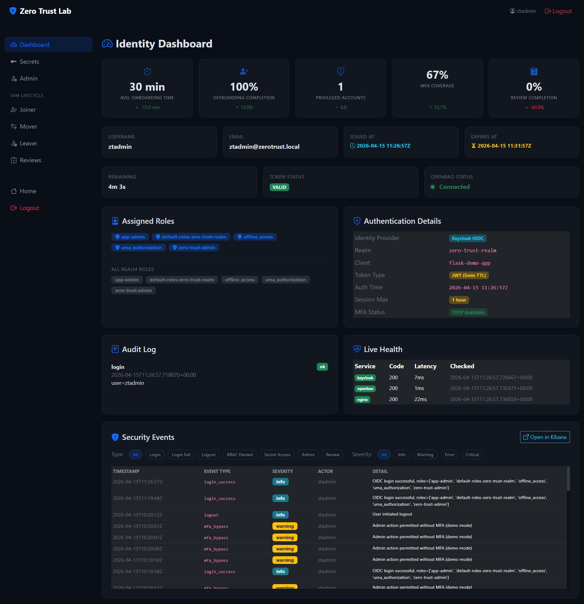

### 4. Dynamic Secrets via OpenBao
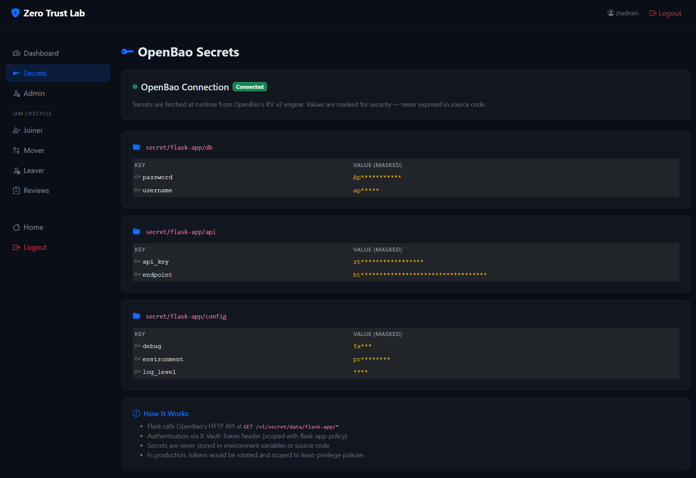

### 5. IAM Administration Hub
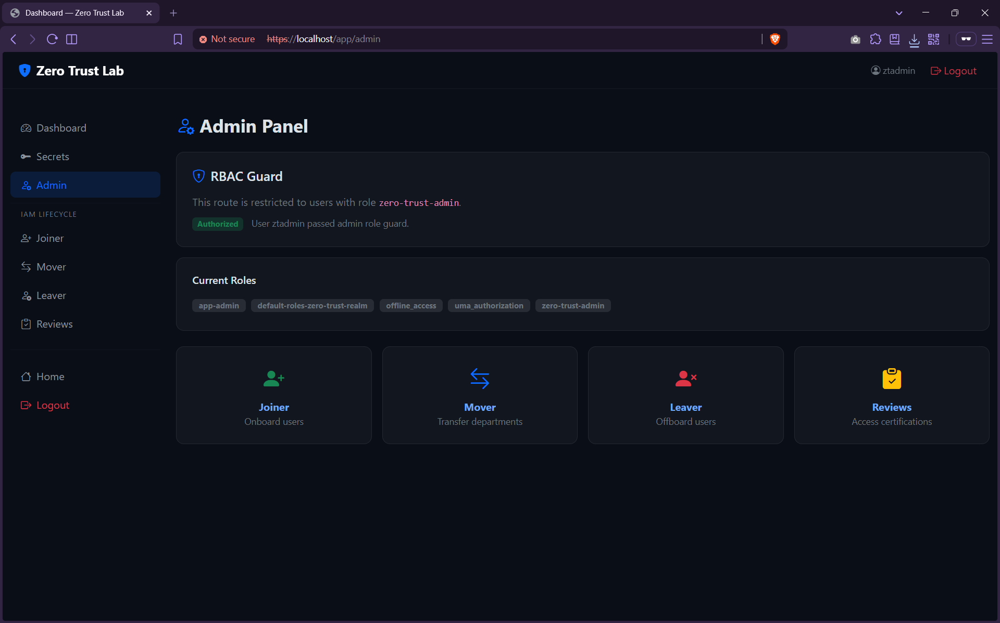

### 6. Joiner Workflow (Onboarding & Auto-Provisioning)
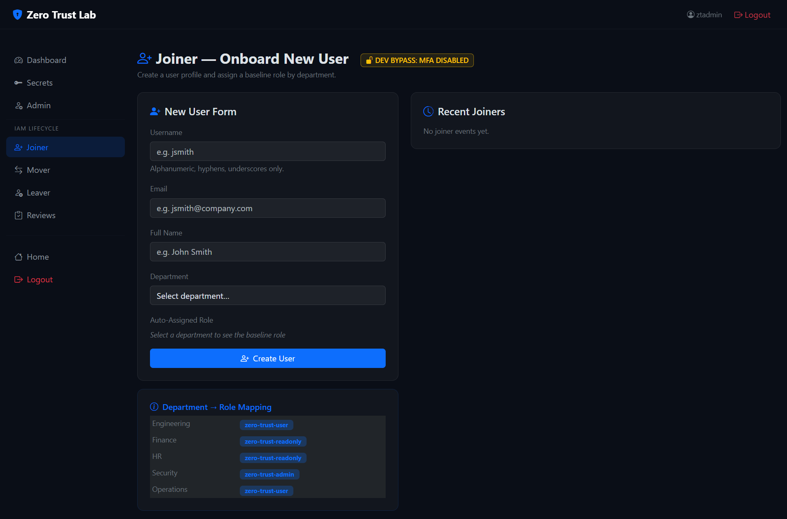
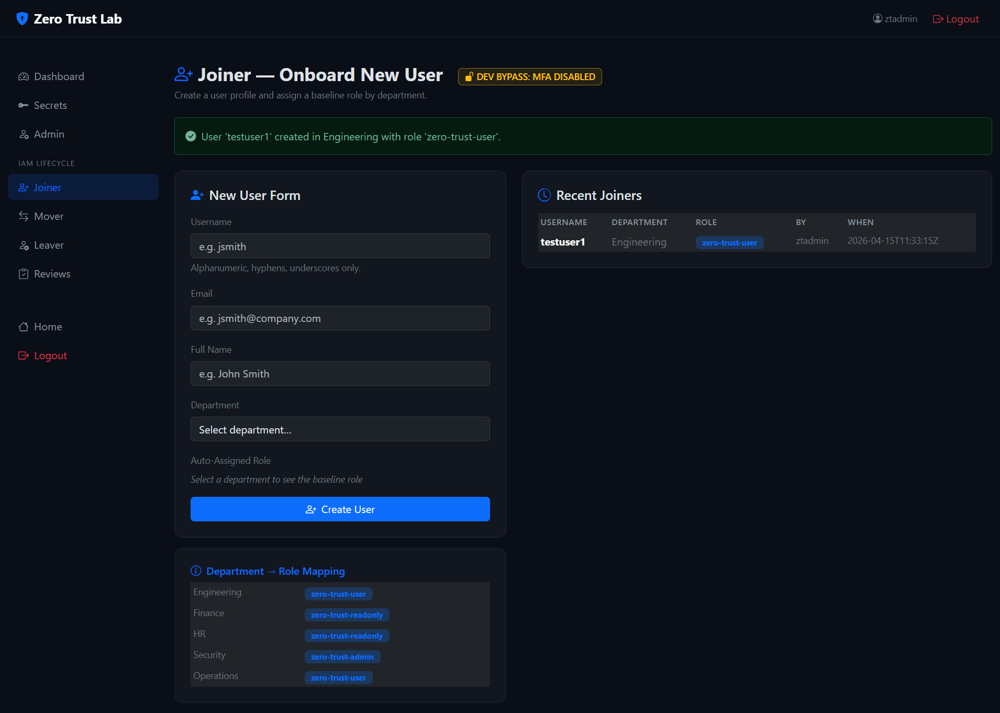

### 7. Mover Workflow (Role Recomputation)
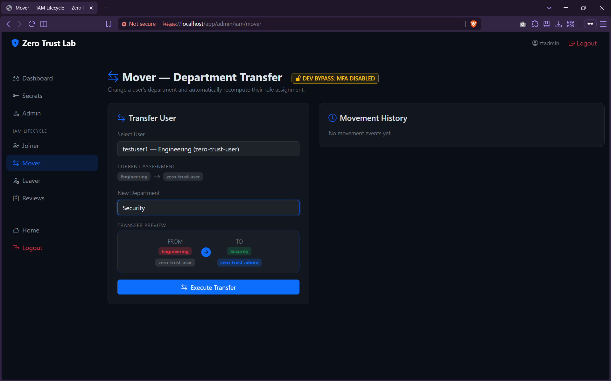

### 8. Leaver Workflow (Total Session & Access Revocation)
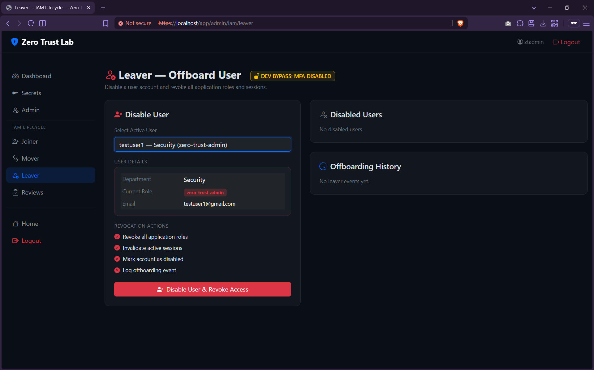

### 9. Access Review Governance
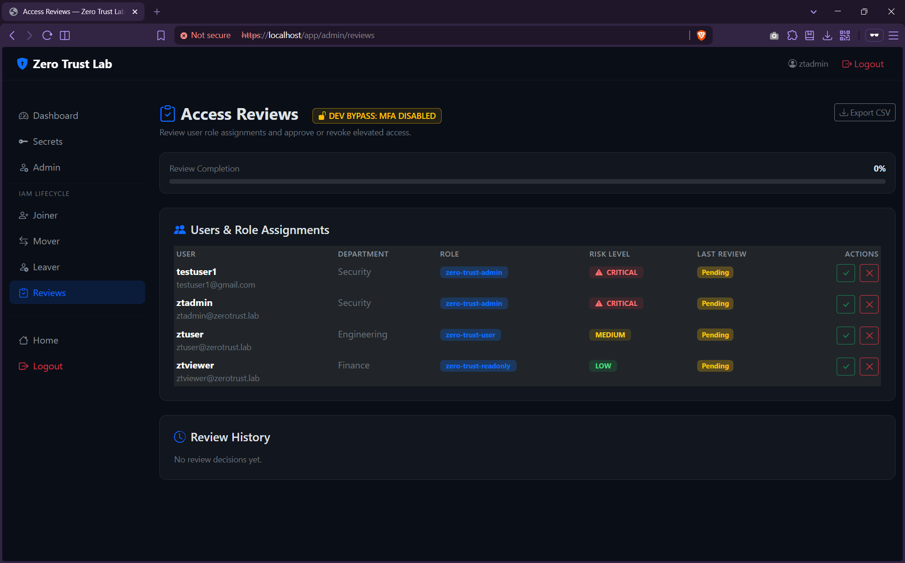
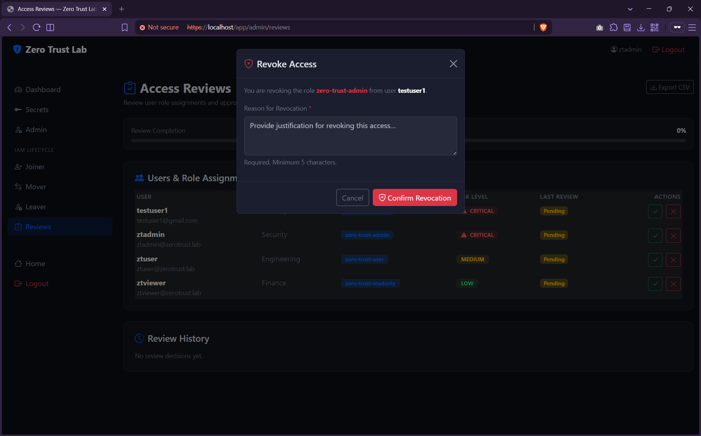

---

## How This Maps to Enterprise IAM Services

| This Lab | Azure AD / Entra ID | Okta | SailPoint |
|---|---|---|---|
| Keycloak OIDC SSO | Azure AD App Registration | Okta OIDC Integration | — |
| JML Joiner | Azure AD user provisioning via SCIM | Okta lifecycle hooks | IdentityNow Joiner Rule |
| JML Mover | Azure AD dynamic groups | Okta profile attribute mapping | IdentityNow Mover Rule |
| JML Leaver | Azure AD user disable + licence revoke | Okta deactivate user | IdentityNow Leaver Rule |
| Access Reviews | Azure AD Access Reviews | Okta Access Certifications | Access Campaigns |
| MFA Enforcement | Conditional Access + MFA challenge | Adaptive MFA policies | — |
| Security Events | Azure AD Sign-in Logs + Sentinel | Okta System Log | Activity Monitoring |
| KPI Dashboard | Identity Governance Analytics | Okta Reports | IdentityNow Dashboards |
| OpenBao Secrets | Azure Key Vault | Okta Credential Management | — |
| RBAC | Azure AD Roles + Privileged Identity Mgmt | Okta Groups + App Assignments | Entitlements |

---

## Project Structure

```
zero-trust-identity-lab/
├── docker-compose.yml          # Full stack orchestration
├── .env                        # Environment secrets (gitignored)
├── .env.example                # Template with placeholder values
├── README.md                   # This file
├── ARCHITECTURE.md             # Detailed architecture documentation
├── nginx/
│   ├── nginx.conf              # TLS reverse proxy configuration
│   └── ssl/
│       └── generate-certs.sh   # Self-signed certificate generator
├── keycloak/
│   ├── realm-export.json       # Pre-configured realm with users/roles
│   └── themes/                 # Custom theme placeholder
├── openbao/
│   ├── config/openbao.hcl      # Server configuration
│   └── init/setup.sh           # Secret seeding script
├── flask-app/
│   ├── Dockerfile              # Python 3.12 container image
│   ├── requirements.txt        # Pinned Python dependencies
│   ├── app.py                  # OIDC + OpenBao + IAM workflows
│   ├── iam_store.py            # SQLite IAM data layer
│   └── templates/
│       ├── index.html          # Public landing page
│       ├── dashboard.html      # Dashboard + SIEM + KPIs
│       ├── login_required.html # Auth/session failure page
│       ├── mfa_required.html   # MFA enforcement page
│       ├── iam_joiner.html     # JML Joiner workflow
│       ├── iam_mover.html      # JML Mover workflow
│       ├── iam_leaver.html     # JML Leaver workflow
│       └── access_reviews.html # Access review certifications
├── elk/
│   ├── elasticsearch/          # ES single-node config
│   ├── kibana/                 # Kibana config with base path
│   └── filebeat/               # Log shipping configuration
├── scripts/
│   ├── bootstrap.sh            # One-command deployment
│   ├── keycloak-configure.sh   # Realm verification
│   └── healthcheck.sh          # Service status checker
└── docs/
    ├── screenshots/            # UI screenshots (post-deployment)
    ├── zero-trust-flow.md      # Authentication flow diagram
    └── setup-guide.md          # Detailed setup & Kibana guide
```

---

## Troubleshooting

See [docs/setup-guide.md](docs/setup-guide.md) for detailed troubleshooting, including:
- Docker networking issues
- Keycloak startup failures
- Certificate problems
- Elasticsearch heap issues
- OpenBao connection errors

### Keycloak Client Settings (flask-demo-app)

If OIDC login loops, callback fails, or shows invalid redirect errors, verify the `flask-demo-app` client in Keycloak:

- Client type / access type: **Confidential**
- Client authentication: **Enabled**
- Valid redirect URIs:
  - `https://localhost/app/callback`
  - `https://localhost/app/*`
  - `http://localhost:5000/callback` (optional direct fallback)
- Web origins:
  - `https://localhost`
  - `http://localhost:5000` (optional)

These values must match the Flask app OIDC environment values from `docker-compose.yml`.

### OIDC Diagnostics Commands

```bash
docker compose logs --tail=200 flask-app
docker compose logs --tail=200 nginx
curl -kI https://localhost/auth/realms/zero-trust-realm/.well-known/openid-configuration
curl -kI https://localhost/app/
```

Expected quick checks:
- Discovery endpoint returns `HTTP/1.1 200 OK`
- App endpoint returns `HTTP/1.1 200 OK`
- Flask logs show resolved OIDC settings and login redirect URI
- Nginx logs show `/auth/` and `/app/` requests without upstream resolution crashes

### Token Timing, RBAC, and Audit Verification

```bash
# 1) Verify session token timing fields are populated after login callback
docker compose logs --tail=200 flask-app

# 2) Verify app health endpoint includes live check metadata
curl -k https://localhost/app/health

# 3) Verify RBAC guards
#   - /app/secrets allows zero-trust-admin and zero-trust-user
#   - /app/admin allows zero-trust-admin only
curl -kI https://localhost/app/secrets
curl -kI https://localhost/app/admin

# 4) Verify IAM routes exist (302 redirects to login when unauthenticated)
curl -kI https://localhost/app/admin/iam/joiner
curl -kI https://localhost/app/admin/iam/mover
curl -kI https://localhost/app/admin/iam/leaver
curl -kI https://localhost/app/admin/reviews

# 5) Verify OpenBao access with app-scoped token from Flask container
docker compose exec -T flask-app python -c "import requests; tok=open('/run/secrets/openbao/flask-app-token','r',encoding='utf-8').read().strip(); base='http://openbao:8200/v1'; hdr={'X-Vault-Token':tok}; print('db',requests.get(f'{base}/secret/data/flask-app/db',headers=hdr,timeout=5).status_code); print('api',requests.get(f'{base}/secret/data/flask-app/api',headers=hdr,timeout=5).status_code); print('config',requests.get(f'{base}/secret/data/flask-app/config',headers=hdr,timeout=5).status_code)"

# 6) Verify SQLite database exists
docker compose exec flask-app ls -la /app/data/iam.db
```

### Quick Fixes

```bash
# View all container logs
docker compose logs -f

# Restart a specific service
docker compose restart keycloak

# Full reset (WARNING: destroys all data)
docker compose down -v && docker compose up -d

# Check container health
docker compose ps
```

## License

MIT License — see [LICENSE](LICENSE) for details.
